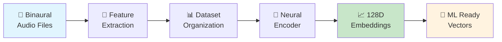

# 🎵 Spatial Audio Embeddings Generator

**Professional-grade pipeline for generating high-quality 128D embeddings from binaural spatial audio recordings**

[](https://www.python.org/downloads/)
[](https://pytorch.org/)
[](https://developer.apple.com/metal/)
[](#architecture)

## 🎯 Overview

This system transforms binaural audio recordings (dummy head captures) into compact, meaningful 128-dimensional embeddings suitable for machine learning applications. Designed for spatial audio format classification with support for **4 distinct classes**:

- **🎬 5.1+4h**: Immersive audio with height channels  
- **🔊 5.1**: Traditional surround sound
- **🎧 2.0**: Stereo recordings
- **📻 1.0**: Mono audio

## ✨ Key Features

### 🧠 **Neural Embeddings**
- **128D L2-normalized embeddings** via CNN-based encoder
- **Metal Performance Shaders (MPS)** acceleration on Apple Silicon
- **Clustering metrics** with t-SNE/PCA visualizations

### 🎼 **Binaural Spatial Features**
- **Interaural Features**: IPD, ITD, ILD analysis
- **Spatial Correlation**: Cross-channel relationships  
- **Spectral Differences**: Frequency-domain spatial cues
- **Pseudo-Intensity Vectors**: Directional information extraction

### 🏗️ **SOLID Architecture**
- **Dependency Injection** with Factory Pattern
- **Interface-based design** for extensibility
- **Clean separation** of concerns
- **Professional error handling** and logging

## 🚀 Quick Start

### Installation

```bash
# Clone repository
git clone <repository-url>
cd embeddings_create

# Install dependencies (using uv package manager)
uv install

# Activate virtual environment
source .venv/bin/activate
```

### Complete Pipeline

```bash
# Process binaural audio recordings → generate embeddings
python main.py pipeline audios_input/ --verbose

# This runs the complete pipeline:
# 1️⃣ Extract spatial features from .wav files
# 2️⃣ Organize into 4-class dataset
# 3️⃣ Generate 128D embeddings with MPS acceleration
# 4️⃣ Create visualizations and compute metrics
```

### Individual Commands

```bash
# Extract spatial features only
python main.py extract audios_input/ -o features_extracted/ -v

# Organize features into dataset
python main.py organize features_extracted/ -o dataset.npz -v

# Generate embeddings from dataset
python main.py embeddings dataset.npz -o embeddings.npz --visualize -v
```

## 📊 Pipeline Overview



## 🎼 Spatial Features Extracted

### Interaural Analysis
- **IPD**: Inter-channel Phase Differences
- **ITD**: Interaural Time Differences  
- **ILD**: Interaural Level Differences

### Spatial Correlation
- Cross-channel coherence analysis
- Frequency-dependent spatial relationships

### Spectral Processing  
- Left-right spectral differences
- Magnitude and phase analysis

### Directional Cues
- Pseudo-intensity vector computation
- Azimuth/elevation estimation proxies

## 🏗️ Architecture

Built following **SOLID principles** with professional software practices:

```
embeddings_create/
├── interfaces/          # 📋 Abstract contracts (SOLID-D)
│   └── pipeline_interfaces.py
├── pipeline/           # 🔧 Concrete implementations (SOLID-S,O)
│   └── implementations.py  
├── factories/          # 🏭 Dependency injection (GoF Factory)
│   └── pipeline_factory.py
├── extractors/         # 🎵 Binaural feature extraction
│   └── binaural_extractor.py
├── embeddings/         # 🧠 Neural encoder models
│   └── embedding_model.py
├── scripts/           # 📜 Pipeline orchestration
│   ├── batch_extract_features.py
│   ├── reorganize_dataset.py
│   └── generate_embeddings.py
└── tests/             # 🧪 Unit testing
    └── test_binaural_features.py
```

### Design Principles Applied

- **S**ingle Responsibility: Each class has one clear purpose
- **O**pen/Closed: Extensible via interfaces without modification  
- **L**iskov Substitution: All implementations are interchangeable
- **I**nterface Segregation: Focused, specific interfaces
- **D**ependency Inversion: Depend on abstractions, not concretions

## 🎯 Use Cases

### 🎬 **Spatial Audio Classification**
Train classifiers to distinguish between immersive, surround, stereo, and mono content

### 🔍 **Content Analysis**
Analyze spatial characteristics of audio productions

### 📊 **Quality Assessment** 
Evaluate spatial audio rendering quality

### 🎨 **Creative Tools**
Build recommendation systems for spatial audio content

## ⚙️ Technical Specifications

### Input Requirements
- **Format**: Binaural WAV recordings (2-channel)
- **Source**: Dummy head captures preferred
- **Sample Rate**: 44.1kHz or 48kHz recommended

### Output Specifications  
- **Embeddings**: 128D vectors, L2-normalized
- **Format**: NumPy .npz archives
- **Visualizations**: t-SNE and PCA plots (PNG)

### Performance
- **MPS Acceleration**: ~3-5x speedup on Apple Silicon
- **Batch Processing**: Optimized for large datasets
- **Memory Efficient**: Streaming processing for large files

## 📈 Results & Metrics

The system provides comprehensive evaluation metrics:

- **Silhouette Score**: Cluster separation quality
- **Intra-class Distance**: Within-class compactness  
- **Inter-class Distance**: Between-class separation
- **Separation Ratio**: Overall clustering performance

## 🔬 Advanced Usage

### Custom Feature Extraction
```python
from embeddings_create.factories.pipeline_factory import PipelineComponentFactory

logger = PipelineComponentFactory.create_logger(verbose=True)
extractor = PipelineComponentFactory.create_feature_extractor(logger)

result = extractor.extract_features(
    input_dir=Path("custom_audio/"),
    output_dir=Path("custom_features/"),
    max_files=100  # Limit for testing
)
```

### Embedding Analysis
```python
from embeddings_create.scripts.generate_embeddings import (
    generate_embeddings_from_dataset,
    compute_embedding_metrics
)

embeddings = generate_embeddings_from_dataset("dataset.npz")
metrics = compute_embedding_metrics(embeddings)
print(f"Silhouette Score: {metrics['silhouette_score']:.3f}")
```

## 🤝 Contributing

1. **Follow SOLID principles** in new implementations
2. **Add interface contracts** before concrete classes  
3. **Include comprehensive docstrings** (Google style)
4. **Write unit tests** for new features
5. **Update documentation** for API changes

## 📄 License

This project is licensed under the MIT License - see the LICENSE file for details.

## 🙏 Acknowledgments

- Built for PhD research in spatial audio processing
- Optimized for Apple Silicon with MPS acceleration
- Architecture inspired by Clean Code and SOLID principles

---

**Ready to transform your spatial audio into ML-ready embeddings? 🚀**

```bash
python main.py pipeline your_audio_files/ --verbose
```
